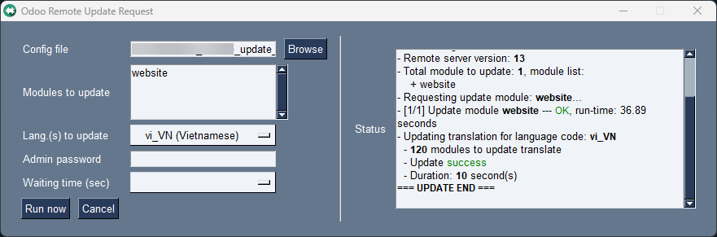

# Odoo Remote Update

A convenient tool help you update one or more module(s) on remote Odoo (OpenERP) server without access Web GUI.

_Package `termcolor` is optional to support colored text in terminal_

* Resources: audio file get from page: https://pixabay.com/sound-effects
  convert mp3 to wave file: `ffmpeg -i <source-file>.mp3 -acodec pcm_u8 -ar 22050 <output-file>.wav`

### Usage example

Firstly, you will need create a config file, example `demo_config.json` with content:
```json
{
    "url": "http://localhost:8069",
    "db": "my_database",
    "username": "admin",
    "password": "admin",
    "modules_to_update": ["foo", "bar"]
}
```

The **password** config is optional.

* To secure the password in file, use Fernet to create password token, the Fernet key must set in environment `ORUR_FERNET_KEY=...` to allow application decrypt the token

  Example config with encrypted password:
    ```json
    {
        "url": "http://localhost:8069",
        "db": "my_database",
        "username": "admin",
        "password": "gAAAAA...",
        "modules_to_update": ["foo", "bar"]
    }
    ```

This config tell application execute update for modules: `foo`, `bar` using target URL `http://localhost:8069` and database `my_database`

### Remote update translation

* For Odoo from version 11.0+, it's required add a patch function for remote call, for reference check: `patch_odoo/ir_module_module.py`, function: `remote_update_translation`

#### Run app

GUI mode will active by default if app call without params.

* **Console** mode:

  Run `app.py` with param:
 
  * `python app.py demo_config.json`
  * or you want to **overwrite** admin password, run: `python app.py demo_config.json real-password`

* **GUI** mode:
  * `python app.py`
  
    > 

### Build execute file

* Build with `pyinstaller`: 
    ```bash
    pyinstaller --onefile --noconsole --name OdooRUR app.py
    # with icon
    # param --add-data to add resource to execute file
    pyinstaller --onefile --noconsole --name OdooRUR --icon resources\icon.ico --add-data "resources\\icon.ico;resources" app.py
    # with icon and sound files
    pyinstaller --onefile --noconsole --name OdooRUR --icon resources\icon.ico --add-data "resources\\icon.ico;resources" --add-data "resources\\success.wav;resources" --add-data "resources\\error.wav;resources" app.py
    ```
